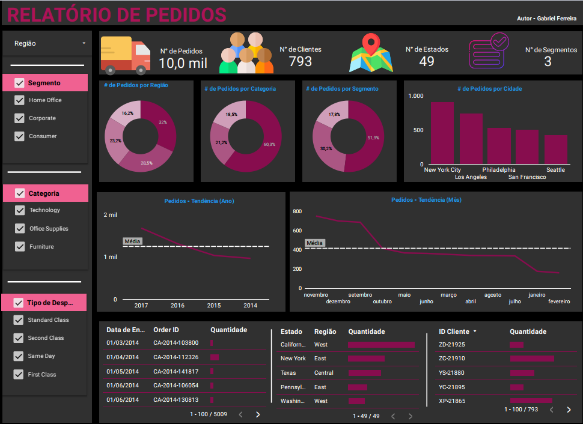

# Project: Order Dashboard - Sales and Logistics Analysis

### ➡️ Detailed Analysis and Interactive Dashboard in My Portfolio:
[Access the full project page here](https://ferreiragabrielw.github.io/portfolio-gabriel/projetos/Dashboards/10DashboardLoockerStudio/Projeto10DA.html)

---

## About the Project

This order analysis dashboard, developed in **Looker Studio**, offers a comprehensive view of order volume, customer base, geographical sales distribution, and consumption trends. It aims to monitor sales performance, identify promising markets, optimize the supply chain, and improve customer experience through the analysis of dispatch types and locations.

## Technologies and Process

*   **Tool**: Looker Studio.
*   **ETL**: Data extracted from `.csv` and an Excel file, transformed (cleaning, calculated fields), and modeled directly within the Looker Studio environment.
*   **Key Insights**: Large volume of orders (10 thousand) for 793 customers across 49 states, dominance of the 'Consumer' segment (51.9%), leadership of 'Office Supplies' (60.3%) by category, 'New York City' as the main city for orders, and temporal trends from 2014 to 2017.

## Repository Content

*   `data/`: Used database (`.csv`).
*   `dashboard/`: Files related to the dashboard and the PDF containing the Dashboard.
*   `quarto/`: `.qmd` file and its rendered HTML version.
*   `README.md`: This document.
*   `LICENSE`: Project license (MIT License).

## How to View

*   **Online**: [Access the published dashboard on Looker Studio](https://lookerstudio.google.com/u/0/reporting/53c1abb1-9218-456b-9d7f-28f6702033de/page/0avvD)

---

### License

This project is licensed under the [MIT License](LICENSE).
